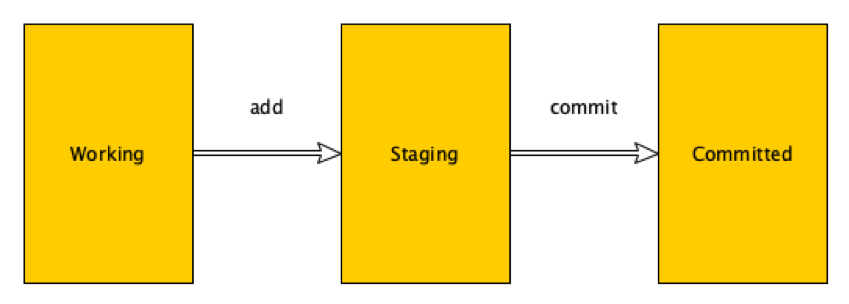

# Git -- Saving Your Changes With Git

This activity is to reinforce and review saving changes to work in Git.
You have been saving your work in the Git repository in previous
classes. This activity offers to review the steps that have been
followed to do the same and refresh student's knowledge.

We will use git to keep track of changes made to the files in your
project.

Content Learning Objectives
---------------------------

*After completing this activity, students should be able to:*

-   Determine whether files are changed or unchanged.

-   Determine whether files are in the git working area or the git
    staging area.

-   Move changed files to the git staging area.

-   Commit files in the git staging area.

-   View the log of commits.

Process Skill Goals
-------------------

*During the activity, students should make progress toward:*

-   Leveraging prior knowledge and experience of other students.
    (Teamwork)

Team Roles
----------

*Decide what role each of you will play for today. Choose a role that
you have not played before, or recently. The goal should be to have all
team members rotate through the roles on a regular basis to become
comfortable with all the roles. If you have only three people, one
should have two roles. If you have five people, two may share the same
role. Record role assignments here.*

| Role      | Name |
| --------- | ---- |
| Manager   |      |
| Presenter |      |
| Recorder  |      |
| Reflector |      |

Model 1: Files can be in one of three states in Git
===================================================



**Working:** Files that you have not finished working on.

**Staging:** Files that you have finished working on, that you will want
to save once you are done making all of your changes.

**Committed:** All files that were changed as part of a new feature or
bug fix for your project. All files in a particular commit were changed
as part of a larger task.

Questions (1 min)
-----------------

1.  What operation will be used to move a changed file from the Working
    area to the Staging area?

2.  What operation will be used to move a group of changed files from
    the Staging area to the Committed area?

Model 2: Before Starting to Work on your Program to add Feature Y.
==================================================================

You are working on your computer. You are about to start making changes
to add Feature Y to the program. You enter the following commands (at
the command line - given in bold) and get the following results:

```bash
$ ls
A.java B.java C.java
$ git log
commit db967767f9ab675dba21e08c5d20627b34cbe133 (HEAD -> master, origin/master, origin/HEAD)
Author: Karl R. Wurst <karl@w-sts.com>
Date:   Fri Jan 18 14:25:44 2019 -0500

    Add Feature X.

$ git status
On branch master
Nothing to commit, working tree clean

$
```

Questions (8 min)
-----------------

1.  How many files are there in this program? What are their names?

2.  What was the last thing that was done to the program?

3.  Who made the last set of changes to the program?

4.  When did they finish making those changes?

5.  What does **git log** tell you about your program?

6.  For each of the files in the program, which of the three states from
    Model 1 (Working, Staging, Committed) do you think it is in? Why?

7.  What does **git status** tell you about your program?

Model 3: Starting to Work on your Program to add Feature Y.
===========================================================

To add Feature Y to your program, you determine that you need to make
changes to the file **B.java**.

```bash
$ edit B.java
$ git status
On branch master
Changes not staged for commit:
  (use "git add <file>..." to update what will be committed)
  (use "git checkout --<file>..." to discard changes in working directory)

        modified: B.java

no changes added to commit (use "git add" and/or "git commit -a")

$
```

Questions (8 min)
-----------------

1.  Which of the three states from Model 1 (Working, Staging, Committed)
    is the file **B.java** in? Why?

2.  Which of the three states from Model 1 are the files **A.java** and
    **C.java** in? Why?

3.  Assuming that you are done with making changes to the file B.java,
    what command should you give to put it into the Staging state? Why?
    Write the command below.

Model 4: Done with One File, But with More to Do
================================================

You want to put **B.java** into a state to indicate that you are done
making changes to it. But you still need to make changes to other files
before you have finished Feature Y.

```bash
$ git add B.java

$ git status
On branch master

Changes to be committed:
  (use "git rm --cached <file>..." to unstage)

          modified: B.java

$
```

Questions (1 min)
-----------------

1.  Which of the three states from Model 1 (Working, Staging, Committed)
    is the file **B.java** in? Why?

Model 5: More Work for Feature Y
================================

To finish adding Feature Y, you realize you need to make a change to the
file A.java, and you need to create a new file D.java.

```bash
$ edit A.java

$ edit D.java

$ git status
On branch master

Changes to be committed:
  (use "git rm --cached <file>..." to unstage)

        modified: B.java

Changes not staged for commit:
  (use "git add <file>..." to update what will be committed)
  (use "git checkout --<file>..." to discard changes in working directory)

        modified: A.java

Untracked files:
  (use "git add <file>..." to include in what will be committed)

        D.java

$
```

Questions (5 min)
-----------------

1.  Which of the three states from Model 1 (Working, Staging, Committed)
    is the file **A.java** in? Why?

2.  Which of the three states from Model 1 (Working, Staging, Committed)
    is the file **B.java** in? Why?

3.  Which of the three states from Model 1 (Working, Staging, Committed)
    is the file **D.java** in? Why?

4.  Which of the three states from Model 1 (Working, Staging, Committed)
    is the file **C.java** in? Why?

5.  You have finished making your changes for Feature Y. You want to
    have the files **A.java, B.java,** and **D.java** all to be in the
    Staging state. What command(s) would you give to make this the case?

Model 6: Done Working on Feature Y
==================================

You have finished making all your changes to implement Feature Y, and
have put all the new and changed files into the Staging area.

```bash
$ git status
On branch master

Changes to be committed:
  (use "git rm --cached <file>..." to unstage)

        modified: A.java
        modified: B.java
        new file: D.java

$ git commit -m "Add Feature Y"
[master 63b66cf] Add Feature Y
3 files changed, 7 insertions(+), 5 deletions(-)
Create mode 100644 D.java

$ git status
On branch master
Nothing to commit, working tree clean

$ git log
commit 63b66cf74632ab3f2ebabb333e71d13938d7f2d4
Author: Karl R. Wurst <karl@w-sts.com>
Date:   Fri Jan 18 16:02:12 2019 -0500

      Add Feature Y

commit db967767f9ab675dba21e08c5d20627b34cbe133 (HEAD -> master, origin/master, origin/HEAD)
Author: Karl R. Wurst <karl@w-sts.com>
Date: Fri Jan 18 14:25:44 2019 -0500

      Add Feature X.
```

Questions (9 min)
-----------------

1.  What is the reason for giving the first **git status** command?

2.  What does the **git commit** command do?

3.  What is the **-m"Add Feature Y"** part of the **git commit**
    command for?

4.  What is the reason for giving the second **git status** command?

5.  What does the git log command show?

6.  What order are commits shown in?

7.  What is the purpose of the
    `commit 63b66cf74632ab3f2ebabb333e71d13938d7f2d4`
    part of the log for? Where else do you see that number?

Copyright © 2019 Karl R. Wurst. This work
is licensed under a Creative Commons Attribution-ShareAlike 4.0
International License.
