# Filesystem -- Navigation

This activity is to reinforce and review Git navigation. You have been
using basic navigation commands for navigating the file system in GitLab
in previous classes. This activity offers to review the steps that have
been followed to do the same and refresh student's knowledge.

Navigating Your File System at the Command Line

The files on your computer are stored in the ***file system***. Your
computer has multiple tools that let you manipulate the file system and
the files within it. These tools may have different representations of
the file system and use different commands to do so.

In this activity we will look at using command line tools to navigate
the file system.

Content Learning Objectives
---------------------------

*After completing this activity, students should be able to:*

-   Locate a file in their file system using command line tools.

 Process Skill Goals
-------------------

*During the activity, students should make progress toward:*

-   Leveraging prior knowledge and experience of other students.
    (Teamwork)

Team Roles
----------

*Decide what role each of you will play for today. Choose a role that
you have not played before, or recently. The goal should be to have all
team members rotate through the roles on a regular basis to become
comfortable with all the roles. If you have only three people, one
should have two roles. If you have five people, two may share the same
role. Record role assignments here.*

  ----------- --
  Manager     
  Presenter   
  Recorder    
  Reflector   
  ----------- --

Model 1: Lab1 Files using the Graphical User Interface (GUI)
============================================================

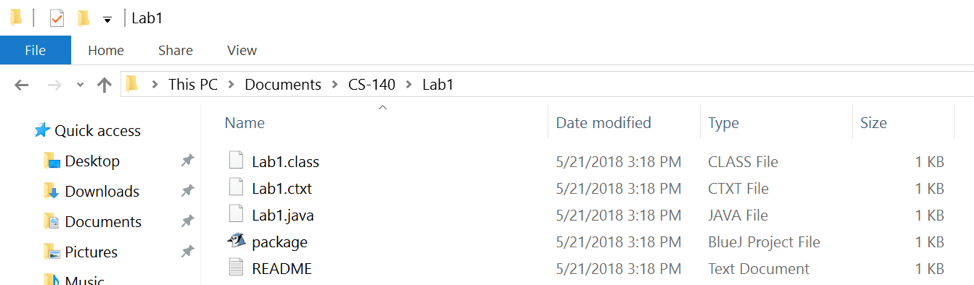

Lab1 on Windows

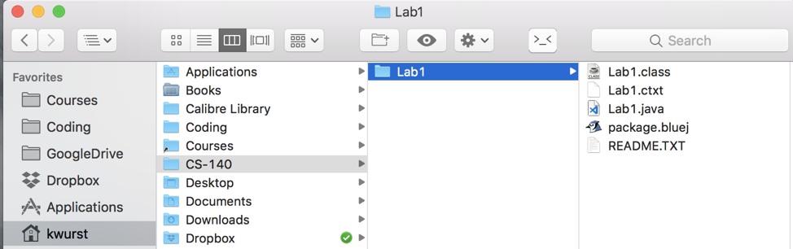

Lab1 on Mac OS

Questions (2 min)
-----------------

1.  Where is the Lab1.java file on the Windows machine? Give the full
    path to the file.

2.  Where is the Lab1.java file on the Mac? Give the full path to the
    file.

Model 2: Starting a Command Line Interface
==========================================

There are multiple programs that provide a command line interface. They
are all slightly different from each other in appearance, even on the
same operation system. But they have enough common features that we
should be able to perform basic operations on any command line
interface.

In a command line interface, you will interactive with the interface by
typing commands (rather than pointing, clicking, and dragging.)

Here we are using **Git Bash** on Windows, and **Terminal** on Mac OS.

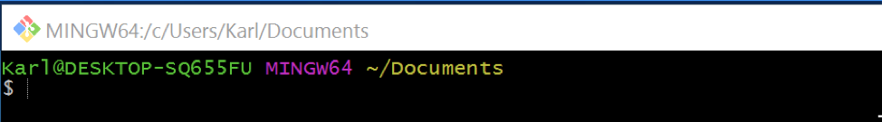

**Git Bash** on Windows

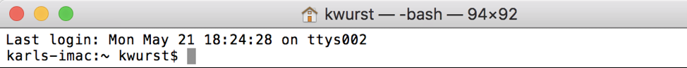

**Terminal** on Mac OS

Questions (1 min)
-----------------

1.  What does the **\$** in each of the interfaces indicate?

Model 3: **pwd** Command
========================

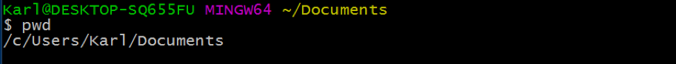

**Git Bash** on Windows

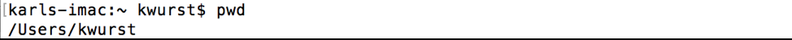

**Terminal** on Mac OS

Questions (1 min)
-----------------

1.  What does the **pwd** command do?

Model 4: **ls** Command
=======================

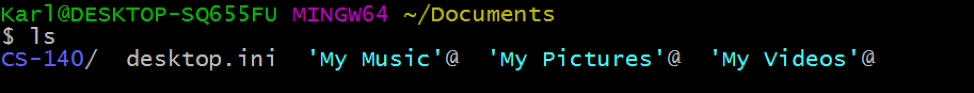

**Git Bash** on Windows

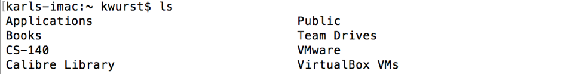

**Terminal** on Mac OS

Questions (1 min)
-----------------

1.  What does the ls command do?

Model 5: **cd** Command
=======================

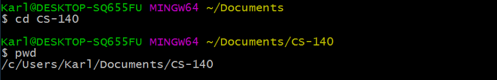

**Git Bash** on Windows

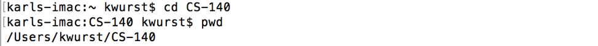

**Terminal** on Mac OS

Questions (1 min)
-----------------

1.  What does the **cd** command do?

2.  What is the purpose of the portion of the command that comes after
    the **cd**?

Model 6: **cd ..** Command
==========================

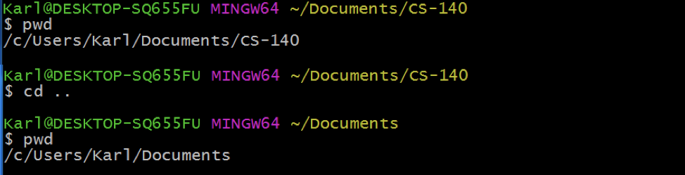

**Git Bash** on Windows

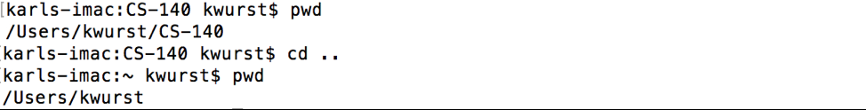

**Terminal** on Mac OS

Questions (1 min)
-----------------

1.  What does **..** mean when used with the **cd** command?

Copyright © 2019 Karl R. Wurst. This work
is licensed under a Creative Commons Attribution-ShareAlike 4.0
International License.
