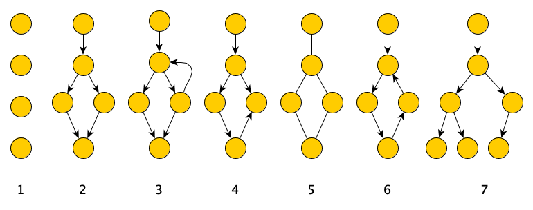
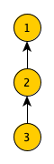
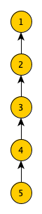
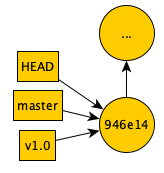
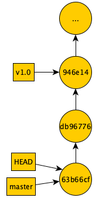

# Git Graph Structure and Branching

The commit structure of git is represented by a directed acyclic graph.
That graph structure allows non-linear commit structures used for
branches used in software development workflows.


Content Learning Objectives
---------------------------

*After completing this activity, students should be able to:*

-   Identify features of graphs.
-   Identify correspondences between git command outputs and the
    underlying directed acyclic graph structure.
-   Explain what HEAD, branch names (like master), and tag names
    represent.
-   Explain how branching and merging works in git.


Process Skill Goals
-------------------

*During the activity, students should make progress toward:*

-   Carefully reading Git command messages for understanding.
    (Information Processing)


Team Roles
----------

*Decide what role each of you will play for today. Choose a role that
you have not played before, or recently. The goal should be to have all
team members rotate through the roles on a regular basis to become
comfortable with all the roles. If you have only three people, one
should have two roles. If you have five people, two may share the same
role. Record role assignments here.*

| Role        | Name |
| ----------- | ---- |
| Manager     |      |
| Presenter   |      |
| Recorder    |      |
| Reflector   |      |


Model 1: Graphs
===============




Questions (4 min)
=================

1.  For each graph above, list the number of nodes it has.

2.  For each graph above, list the number of edges it has.

3.  Which graphs above are *undirected graphs*? Why?

4.  Which graphs above are *directed graphs*? Why?

5.  Which graphs above are *cyclic graphs*? Why?

6.  Which graphs above are *acyclic graphs*? Why?


Model 2: Git Commits Graph Structure
====================================

Git commits are represented as a *directed acyclic graph (DAG)*.

```bash
$ git log
commit 685f4abfccda64d68145bae6a6123bf1e8a88021 (HEAD -> master)
Author: Karl R. Wurst <karl@w-sts.com>
Date: Fri Jan 18 16:19:36 2019 -0500

    Add Feature Z.

commit 63b66cf74632ab3f2ebabb333e71d13938d7f2d4
Author: Karl R. Wurst <karl@w-sts.com>
Date: Fri Jan 18 16:02:12 2019 -0500

    Add Feature Y.

commit db967767f9ab675dba21e08c5d20627b34cbe133
Author: Karl R. Wurst <karl@w-sts.com>
Date: Fri Jan 18 14:25:44 2019 -0500

    Add Feature X.
```


Questions (5 min)
-----------------

1.  Match the commits with the nodes on the DAG. Label the nodes with
    the commit numbers (you only need to list the first 7 digits of
    the commit number.)

    a.  Node 1:

    b.  Node 2:

    c.  Node 3:

2.  Why did you choose that ordering?

3.  What do the edges represent?

4.  Why do the arrows point "backwards"?

5.  Why must the edges be directed?

6.  Which node should also be labeled **HEAD**?


Model 3: A Software Development Scenario
========================================

You are developing a piece of software. The software has been released
as Version 1.0.

*(Note that after Dorothy Dev committed Feature W, Robert Release tagged
the code as v1.0 and ready for release. This was done with the command:
*
*git tag -a v1.0 -m"Version 1.0 for release" )*

```bash
$ git log
commit 946e142c5638795aa2fd5b9555692ac82dea378c (HEAD -> master, tag: v1.0)
Author: Dorothy Dev <dot@awesomesoft.com>
Date:   Fri Jan 18 16:19:36 2019 -0500

    Add Feature W.

$ git show v1.0
tag v1.0
Tagger: Robert Release <rob@awesomesoft.com>
Date:   Fri Jan 18 17:29:36 2019 -0500

    Version 1.0 for release

commit 946e142c5638795aa2fd5b9555692ac82dea378c (HEAD -> master, tag: v1.0)
Author: Dorothy Dev <dot@awesomesoft.com>
Date:   Fri Jan 18 16:19:36 2019 -0500

    Add Feature W.
```

Your team is currently developing Version 2. Version 2 will have three
new features, X, Y, and Z. The new version cannot be released until all
three features are complete.

Your team has completed Feature X and Feature Y, and committed them to
your Git repository.

```bash
$ git log                                                    
commit 63b66cf74632ab3f2ebabb333e71d13938d7f2d4 (HEAD -> master)
Author: Colin Coder <colin@awesomesoft.com>                    
Date:   Fri Jan 18 17:02:12 2019 -0500                              

    Add Feature Y.                                                    

commit db967767f9ab675dba21e08c5d20627b34cbe133                   
Author: Dorothy Dev <dot@awesomesoft.com>                      
Date:   Fri Jan 18 16:25:44 2019 -0500                              

    Add Feature X.                                                    

commit 946e142c5638795aa2fd5b9555692ac82dea378c (tag: v1.0)       
Author: Dorothy Dev <dot@awesomesoft.com>                      
Date:   Fri Jan 18 16:19:36 2019 -0500                              

    Add Feature W.                                                    
```



Before Feature Z can be completed a critical bug is reported. The bug
must be fixed and Version 1.1 released immediately. All work is stopped
on Feature Z, until the bug is fixed and Version 1.1 released.

Once Version 1.1 is released, work can continue on Feature Z. Feature Z
will be committed. And then Release 2.0 can be committed incorporating
all of the new features.

Questions (10 min)
------------------

1.  How will the scenario above be represented on the DAG below?
    You can label nodes with commit messages, rather than commit
    numbers.

    a.  Node 1:

    b.  Node 2:

    c.  Node 3:

    d.  Node 4:

    e.  Node 5:

2.  To which commit will the bug fix be applied?

3.  What problem will that cause?

4.  What commits will release Version 1.1 contain?

5.  To what commit *should* we apply the bug fix?

6.  What ordering would we like to have for the commits?

    f.  Node 1:

    g.  Node 2:

    h.  Node 3:

    i.  Node 4:

    j.  Node 5:

7.  Can you think of a way we could achieve this without reordering the
    nodes? Think about the graphs shown in Model 1.

Model 4: Let's Start Over: Version 1.0
======================================

You are developing a piece of software. The software has been released
as Version 1.0.

*(Note that after Dorothy Dev committed Feature W, Robert Release tagged
the code as v1.0 and ready for release. This was done with the command:
`git tag -a v1.0 -m"Version 1.0 for release"`)*


```bash
$ git log
commit 946e142c5638795aa2fd5b9555692ac82dea378c (HEAD -> master, tag: v1.0)
Author: Dorothy Dev <dot@awesomesoft.com>
Date: Fri Jan 18 16:19:36 2019 -0500

    Add Feature W.

$ git show v1.0
tag v1.0
Tagger: Robert Release <rob@awesomesoft.com>
Date:   Fri Jan 18 17:29:36 2019 -0500

    Version 1.0 for release

commit 946e142c5638795aa2fd5b9555692ac82dea378c (HEAD -> master,
tag: v1.0)
Author: Dorothy Dev <dot@awesomesoft.com>
Date:   Fri Jan 18 16:19:36 2019 -0500

    Add Feature W.
```




Questions (1 min)
-----------------

1.  What does **HEAD** represent?


Model 5: Working on Version 2.0
===============================

Your team is currently developing Version 2. Version 2 will have three
new features, X, Y, and Z. The new version cannot be released until all
three features are complete.

Your team has completed Feature X and Feature Y, and committed them to
your Git repository.

```bash
$ git log
commit 63b66cf74632ab3f2ebabb333e71d13938d7f2d4 (HEAD -> master)
Author: Colin Coder <colin@awesomesoft.com>
Date:   Fri Jan 18 17:02:12 2019 -0500

    Add Feature Y.

commit db967767f9ab675dba21e08c5d20627b34cbe133
Author: Dorothy Dev <dot@awesomesoft.com>
Date:   Fri Jan 18 16:25:44 2019 -0500

    Add Feature X.

commit 946e142c5638795aa2fd5b9555692ac82dea378c (tag: v1.0)
Author: Dorothy Dev <dot@awesomesoft.com>
Date:   Fri Jan 18 16:19:36 2019 -0500

    Add Feature W.
```



Questions (1 min)
-----------------

1.  What does **HEAD** represent?

2.  What does **v1.0** represent?


Model 5: A Bug!
===============

Before Feature Z can be completed a critical bug is reported. The bug
must be fixed and Version 1.1 released immediately. All work is stopped
on Feature Z, until the bug is fixed and Version 1.1
released.


The bug was reported as Issue #1.


Questions (1 min)
-----------------

1.  Based on the current DAG, to which commit do we want to apply the
    bug fix?


Model 6: Fixing the Bug: Creating a Branch
==========================================

Since we want to apply the bug fix to Version 1.0, rather than the
current **HEAD**, we will start a branch. We will name the branch
**issue-1**.


```bash
1 |  $ git branch
  |  * master
  |
2 |  $ git branch issue-1 946e14
  |
3 |  $ git branch
  |  issue-1
  |  * master
  |
4 |  $ git checkout issue-1
  |
5 |  $ git branch
  |  * issue-1
  |  master
```

{width="7.619792213473316in"
height="3.7122058180227473in"}

First DAG Second DAG Third DAG

Questions (8 min)
-----------------

There are three DAGs above, representing different states of the git
repository during the commands.

1.  Which commands are represented by the first DAG?

2.  Which commands are represented by the second DAG?

3.  Which commands are represented by the third DAG?

4.  What does **issue-1** represent?

5.  What does **master** represent?

6.  What does the asterisk (*) represent?

7.  What does **HEAD** represent?

Model 7: Fixing the Bug: Committing the Fix

Once the bug fix is committed by Dorothy Dev, Robert Release tags it a
v1.1 for release.

+-------+--------------------------------------------------------------------+
| **1** | $ **git branch**                                                  |
|       |                                                                    |
| **2** | * issue-1                                                         |
|       |                                                                    |
| **3** | master                                                             |
|       |                                                                    |
| **4** | $ **git commit -m"Fix Issue #1"**                              |
|       |                                                                    |
| **5** | [issue-1 95cda96] Fix Issue #1                                  |
|       |                                                                    |
|       | 1 file changed, 1 insertion(+), 1 deletion(-)                      |
|       |                                                                    |
|       | $ **git log**                                                     |
|       |                                                                    |
|       | commit 95cda96507fcc41390a5e172e2e0ac1ce46ab38c (HEAD -> issue-1) |
|       |                                                                    |
|       | Author: Dorothy Dev <dot@awesomesoft.com>                       |
|       |                                                                    |
|       | Date: Sat Jan 19 9:45:02 2019 -0500                                |
|       |                                                                    |
|       | Fix Issue #1                                                      |
|       |                                                                    |
|       | commit 946e142c5638795aa2fd5b9555692ac82dea378c (tag: v1.0)        |
|       |                                                                    |
|       | Author: Dorothy Dev <dot@awesomesoft.com>                       |
|       |                                                                    |
|       | Date: Fri Jan 18 16:19:36 2019 -0500                               |
|       |                                                                    |
|       | Add Feature W.                                                     |
|       |                                                                    |
|       | $ **git tag -a v1.1 -m"Version 1.1 for release"**               |
|       |                                                                    |
|       | $ **git show v1.0**                                               |
|       |                                                                    |
|       | tag v1.1                                                           |
|       |                                                                    |
|       | Tagger: Robert Release <rob@awesomesoft.com>                    |
|       |                                                                    |
|       | Date: Sat Jan 19 10:29:36 2019 -0500                               |
|       |                                                                    |
|       | Version 1.1 for release                                            |
|       |                                                                    |
|       | commit 95cda96507fcc41390a5e172e2e0ac1ce46ab38c (HEAD -> issue-1) |
|       |                                                                    |
|       | Author: Dorothy Dev <dot@awesomesoft.com>                       |
|       |                                                                    |
|       | Date: Sat Jan 19 9:45:02 2019 -0500                                |
|       |                                                                    |
|       | Fix Issue #1                                                      |
+-------+--------------------------------------------------------------------+

{width="3.4375in" height="3.75in"}

Questions (2 min)
-----------------

1.  Why do you think Dorothy Dev issued command #1?

2.  Why does commit **95cda96** point to **94e14m** (rather than
    > **63b66cf**)?

3.  Why doesn't command #3 show commits **db96776** and **63b66cf**?

Model 8: Merging the Bug Fix Into Version 2

We are ready to get back to work on Version 2. The last thing to do is
add Feature Z.

But, we should be sure to make sure the bug fix code gets into the code
before we release Version 2.

We have two choices:

1.  Merge in the bug fix before adding Feature Z.

2.  Merge in the bug fix after adding Feature Z.

Which one we choose will depend on the impact of the bug fix on the new
code.

Let's assume that it's a better idea to merge in the bug fix right away,
before adding Feature Z.

+-----------------------------------+-----------------------------------+
| **1**                             | $ **git branch**                 |
|                                   |                                   |
| **2**                             | * issue-1                        |
|                                   |                                   |
| **3**                             | master                            |
|                                   |                                   |
| **4**                             | $ **git checkout master**        |
|                                   |                                   |
| **5**                             | Switched to branch 'master'     |
|                                   |                                   |
|                                   | $ **git branch**                 |
|                                   |                                   |
|                                   | issue-1                           |
|                                   |                                   |
|                                   | * master                         |
|                                   |                                   |
|                                   | $ **git merge issue-1**          |
|                                   |                                   |
|                                   | Merge made by the 'recursive'   |
|                                   | strategy.                         |
|                                   |                                   |
|                                   | a.java | 2 +-                    |
|                                   |                                   |
|                                   | 1 file changed, 1 insertion(+), 1 |
|                                   | deletion(-)                       |
|                                   |                                   |
|                                   | $ **git log**                    |
|                                   |                                   |
|                                   | commit                            |
|                                   | d05bd5c8760d8c5af94ccb690e9f0d695 |
|                                   | 0bd5ff8                           |
|                                   | (HEAD -> master)                 |
|                                   |                                   |
|                                   | Merge: 95cda96 63b66c             |
|                                   |                                   |
|                                   | Author: Colin Coder               |
|                                   | <colin@awesomesoft.com>        |
|                                   |                                   |
|                                   | Date: Mon Jan 21 9:18:30 2019     |
|                                   | -0500                             |
|                                   |                                   |
|                                   | Merge branch 'issue-1'          |
|                                   |                                   |
|                                   | commit                            |
|                                   | 63b66cf74632ab3f2ebabb333e71d1393 |
|                                   | 8d7f2d4                           |
|                                   | (Author: Author: Colin Coder      |
|                                   | <colin@awesomesoft.com>        |
|                                   |                                   |
|                                   | Date: Fri Jan 18 17:02:12 2019    |
|                                   | -0500                             |
|                                   |                                   |
|                                   | Add Feature Y.                    |
|                                   |                                   |
|                                   | commit                            |
|                                   | db967767f9ab675dba21e08c5d20627b3 |
|                                   | 4cbe133                           |
|                                   |                                   |
|                                   | Author: Dorothy Dev               |
|                                   | <dot@awesomesoft.com>          |
|                                   |                                   |
|                                   | Date: Fri Jan 18 16:25:44 2019    |
|                                   | -0500                             |
|                                   |                                   |
|                                   | Add Feature X.                    |
|                                   |                                   |
|                                   | commit                            |
|                                   | 946e142c5638795aa2fd5b9555692ac82 |
|                                   | dea378c                           |
|                                   | (tag: v1.0)                       |
|                                   |                                   |
|                                   | Author: Dorothy Dev               |
|                                   | <dot@awesomesoft.com>          |
|                                   |                                   |
|                                   | Date: Fri Jan 18 16:19:36 2019    |
|                                   | -0500                             |
|                                   |                                   |
|                                   | Add Feature W.                    |
+-----------------------------------+-----------------------------------+

{width="3.46875in" height="4.53125in"}

Questions (8 min)
-----------------

1.  What is the result of issuing command #2?

2.  Why did Colin Coder issue command #2?

3.  Which command created commit **d05bd5c**?

4.  Where are the two edges coming out of the node **d05bd5c**
    > represented in the log?

5.  How would the resulting graph be different if Colin had not issued
    > command #2, and had issued **git merge master** instead of **git
    > merge issue-1**? (Assume that the newly created node would still
    > be **d05bd5c.)**

    a.  Where would the edges coming out of node **d05bd5c** point? Why?

    b.  Which node would **HEAD** point to? Why?

    c.  Which node would **master** point to? Why?

    d.  Which node would **issue-1** point to? Why?

    e.  Which node would **v1.1** point to? Why?

    f.  Why would this have been a bad choice? Explain in words how this
        > would be different what what we wanted to do.

{width="0.9635422134733158in"
height="0.3331867891513561in"}Copyright © 2019 Karl R. Wurst. This work
is licensed under a Creative Commons Attribution-ShareAlike 4.0
International License.
